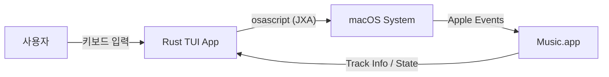

# Apple Music TUI Remote (macOS) 개발 가이드

이 문서는 **macOS Music.app**을 제어하는 **Terminal UI (TUI) 리모트 컨트롤러**를 개발하기 위한 기술 가이드입니다. 이 문서는 향후 개발을 담당할 AI 에이전트 또는 개발자가 참고할 수 있도록 작성되었습니다.

## 1. 아키텍처 개요

이 프로젝트의 핵심은 **"Music.app 원격 제어"**입니다. 자체적인 오디오 엔진을 구현하지 않고, macOS에 내장된 AppleScript(JXA) 인터페이스를 활용하여 백그라운드에서 실행 중인 Music 앱에 명령을 보냅니다.

### 시스템 구조
*   **Frontend (TUI)**: Rust + `ratatui` (사용자 입력 및 화면 표시)
*   **Backend (Controller)**: Rust + `std::process::Command` (AppleScript 실행)
*   **Target**: macOS Music.app (실제 오디오 재생 및 데이터 소스)



## 2. 핵심 기술 스택

1.  **언어**: Rust
2.  **UI 프레임워크**: [ratatui](https://github.com/ratatui/ratatui) (Spotify-player와 동일한 Look & Feel)
3.  **비동기 런타임**: [tokio](https://tokio.rs/) (UI 렌더링과 폴링 루프 분리)
4.  **통신 방식**: **JXA (JavaScript for Automation)**
    *   기존 AppleScript보다 문법이 친숙하고 JSON 파싱이 용이한 JXA를 권장합니다.
    *   실행 명령어: `osascript -l JavaScript -e "..."`

## 3. 기능 구현 상세 가이드

### 3.1. Music 앱 제어 (Commands)

Rust에서 `std::process::Command`를 사용하여 다음 JXA 스크립트를 실행합니다.

| 기능 | JXA 코드 (Application("Music")...) |
| :--- | :--- |
| **재생/일시정지** | `.playpause()` |
| **다음 곡** | `.nextTrack()` |
| **이전 곡** | `.previousTrack()` |
| **재생 상태 확인** | `.playerState()` (Returns: "playing", "paused", "stopped") |
| **볼륨 설정** | `.soundVolume = 50` (0~100) |

**Rust 구현 예시:**
```rust
use std::process::Command;

fn run_jxa(script: &str) -> std::io::Result<String> {
    let output = Command::new("osascript")
        .arg("-l")
        .arg("JavaScript")
        .arg("-e")
        .arg(script)
        .output()?;
        
    Ok(String::from_utf8_lossy(&output.stdout).trim().to_string())
}

// 예: 재생/일시정지 토글
run_jxa("Application('Music').playpause()");
```

### 3.2. 현재 재생 정보 가져오기 (Polling)

Music 앱은 상태 변경 이벤트를 푸시해주지 않으므로, **주기적인 폴링(Polling)**이 필요합니다. (권장 주기: 1초)

**JXA 스크립트 (JSON 리턴):**
```javascript
const music = Application("Music");
const track = music.currentTrack();
JSON.stringify({
    name: track.name(),
    artist: track.artist(),
    album: track.album(),
    duration: track.duration(),
    playerPosition: music.playerPosition(),
    state: music.playerState()
})
```
*   **주의**: `playerState`가 "stopped"일 때 `currentTrack()`을 호출하면 에러가 발생할 수 있으므로 예외 처리가 필수적입니다.

### 3.3. 앨범 아트워크 처리

Music 앱에서 현재 트랙의 아트워크 원본 데이터(Raw Data)를 가져올 수 있습니다.

```javascript
// JXA로 아트워크 데이터 가져오기 (Base64 인코딩 필요)
const music = Application("Music");
const artwork = music.currentTrack().artworks()[0];
const data = artwork.rawData(); 
// ... 이후 Rust 쪽에서 Base64 디코딩 후 viuer 등으로 렌더링
```
*   터미널 표시 라이브러리: [viuer](https://github.com/atanunq/viuer) 추천 (`spotify-player`와 동일)

## 4. 개발 로드맵 (Step-by-Step)

개발 에이전트는 다음 순서로 작업을 진행해야 합니다.

1.  **PoC (Proof of Concept)**
    *   Rust 프로젝트 생성 (`cargo new apple-music-tui`)
    *   `osascript`를 호출하여 Music 앱을 재생/정지하는 간단한 CLI 구현.
    *   현재 곡 정보를 JSON으로 받아와서 파싱하는 로직 구현.

2.  **TUI 골격 잡기**
    *   `ratatui` 기본 템플릿 적용.
    *   UI 레이아웃 구성 (상단: 재생 정보, 하단: 진행 바/컨트롤 가이드).

3.  **비동기 루프 및 상태 관리**
    *   `tokio::spawn`으로 1초마다 상태를 폴링하는 백그라운드 태스크 생성.
    *   `Arc<Mutex<AppState>>`를 통해 UI 스레드와 데이터 동기화.

4.  **고급 기능 (Optional)**
    *   **재생 목록 조회**: `Application("Music").playlists()` 접근.
    *   **검색**: Music 앱 자체 검색 API는 제한적이므로, 로컬 라이브러리 필터링 위주로 구현.

## 5. 참고 자료
*   **JXA Cookbook**: [https://github.com/JXACookbook](https://github.com/JXA-Cookbook)
*   **Apple Music Rust Crate**: [https://crates.io/crates/apple-music](https://crates.io/crates/apple-music) (직접 JXA를 짜는 대신 이 크레이트를 래퍼로 사용 가능)

---
**주의사항**:
이 앱은 **macOS 전용**입니다. `#[cfg(target_os = "macos")]` 속성을 사용하여 다른 OS에서의 빌드 실패를 방지하십시오.
